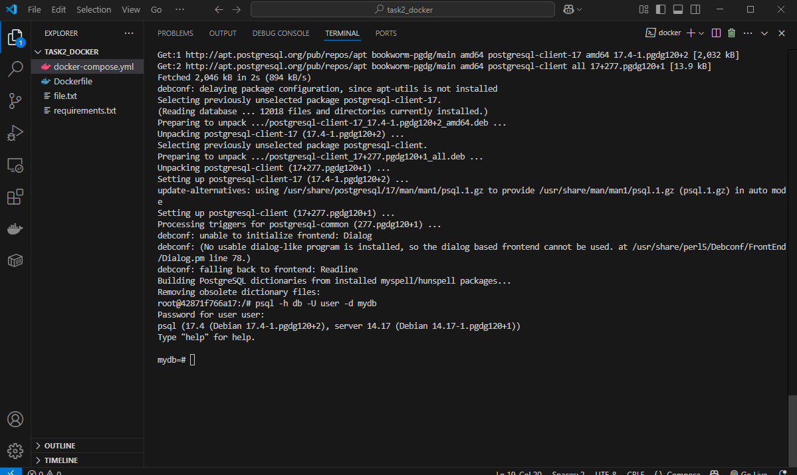
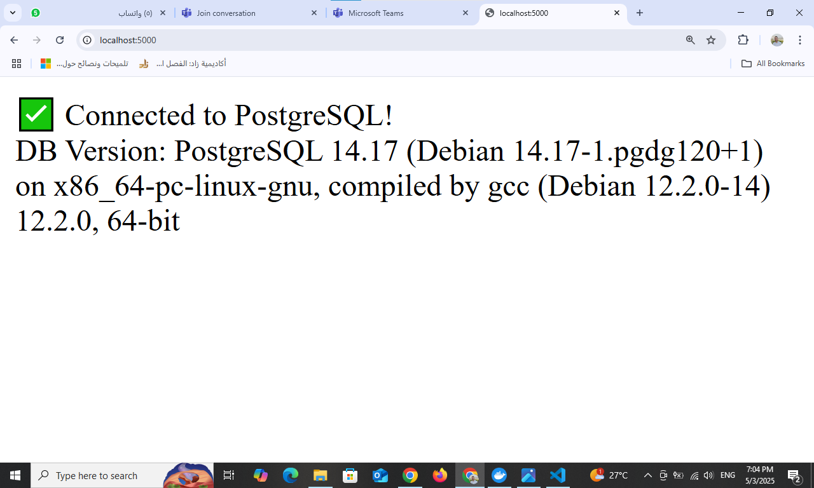

# Flask + PostgreSQL Dockerized Web App

This project showcases a containerized Flask web application integrated with a PostgreSQL database using Docker Compose. The app connects to the database and displays the PostgreSQL version in the browser, demonstrating a scalable, Dockerized backend setup.

[](https://github.com/Abdelhameed97/flask-postgres-docker)

## 📋 Table of Contents
- [About](#about)
- [Features](#features)
- [Project Structure](#project-structure)
- [Prerequisites](#prerequisites)
- [How to Run](#how-to-run)
- [Screenshots](#screenshots)
- [Troubleshooting](#troubleshooting)
- [Tech Stack](#tech-stack)
- [Contributing](#contributing)
- [License](#license)

## 📖 About
This project is a minimal yet powerful example of a Flask web app running in a Docker container, connected to a PostgreSQL database. It serves as a starting point for building scalable web applications with containerized environments, ideal for developers learning Docker, Flask, or database integration.

## 🚀 Features
- Flask web application with a simple endpoint
- PostgreSQL database in a separate container
- Docker Compose for easy orchestration
- Environment variables for secure configuration
- Persistent PostgreSQL data via Docker volumes
- Browser-based verification of database connectivity
- Lightweight and production-ready setup

## 📁 Project Structure
```
.
├── app.py                 # Flask application
├── Dockerfile            # Flask app container definition
├── docker-compose.yml    # Docker Compose configuration
├── requirements.txt      # Python dependencies
└── screenshots/          # Screenshots of the app
    ├── psql_connection.png
    └── web_app_browser.png
```

## 🛠️ Prerequisites
Ensure you have the following installed:
- [Docker](https://docs.docker.com/get-docker/)
- [Docker Compose](https://docs.docker.com/compose/install/)
- [Git](https://git-scm.com/downloads)

## ⚙️ How to Run

1. **Clone the Repository**:
   ```bash
   git clone https://github.com/Abdelhameed97/flask-postgres-docker.git
   cd flask-postgres-docker
   ```

2. **Set Up Environment Variables**:
   Create a `.env` file in the project root:
   ```
   DB_NAME=mydb
   DB_USER=user
   DB_PASSWORD=securepassword
   DB_HOST=db
   ```
   > **Note**: Ensure `.env` is added to `.gitignore` to avoid exposing sensitive data.

3. **Build and Start Containers**:
   ```bash
   docker-compose up -d --build
   ```
   This builds the Flask app image and starts the web and PostgreSQL containers.

4. **Verify PostgreSQL Connection**:
   - Access the web container:
     ```bash
     docker exec -it flask-postgres-docker-web-1 bash
     ```
   - Install the PostgreSQL client and test the connection:
     ```bash
     apt update && apt install -y postgresql-client
     psql -h db -U user -d mydb
     ```

5. **View the Web App**:
   - Open your browser and navigate to [http://localhost:5000](http://localhost:5000).
   - You should see the PostgreSQL version displayed.

6. **Stop the Containers**:
   ```bash
   docker-compose down
   ```
   To remove volumes as well, use:
   ```bash
   docker-compose down -v
   ```

## 📸 Screenshots
| PSQL Connection | Flask App in Browser |
|-----------------|----------------------|
|  |  |

## 🛠️ Troubleshooting
- **Port 5000 in use**:
  Check for conflicts:
  ```bash
  sudo lsof -i :5000
  kill -9 <PID>
  ```
- **Database connection error**:
  - Ensure the `db` service is running: `docker ps`.
  - Verify `.env` variables match `docker-compose.yml`.
- **Container exits unexpectedly**:
  Check logs:
  ```bash
  docker logs flask-postgres-docker-web-1
  docker logs flask-postgres-docker-db-1
  ```
- **Persistent data issues**:
  Confirm the `pgdata` volume exists: `docker volume ls`.

## 🧪 Tech Stack
- **Python 3.10**: Backend language
- **Flask**: Web framework
- **PostgreSQL 14**: Relational database
- **Docker**: Containerization
- **Docker Compose**: Multi-container orchestration

## 🤝 Contributing
Contributions are welcome! To contribute:
1. Fork the repository.
2. Create a feature branch (`git checkout -b feature/your-feature`).
3. Commit changes (`git commit -m 'Add your feature'`).
4. Push to the branch (`git push origin feature/your-feature`).
5. Open a pull request.

Please report issues or suggest features via [GitHub Issues](https://github.com/Abdelhameed97/flask-postgres-docker/issues).

## 📄 License
This project is licensed under the MIT License. See the [LICENSE](LICENSE) file for details.

## 🚀 Next Steps
- Extend the app with a REST API for CRUD operations.
- Deploy to a cloud platform like AWS ECS or Google Cloud Run.
- Add a frontend (e.g., React) in a separate container.